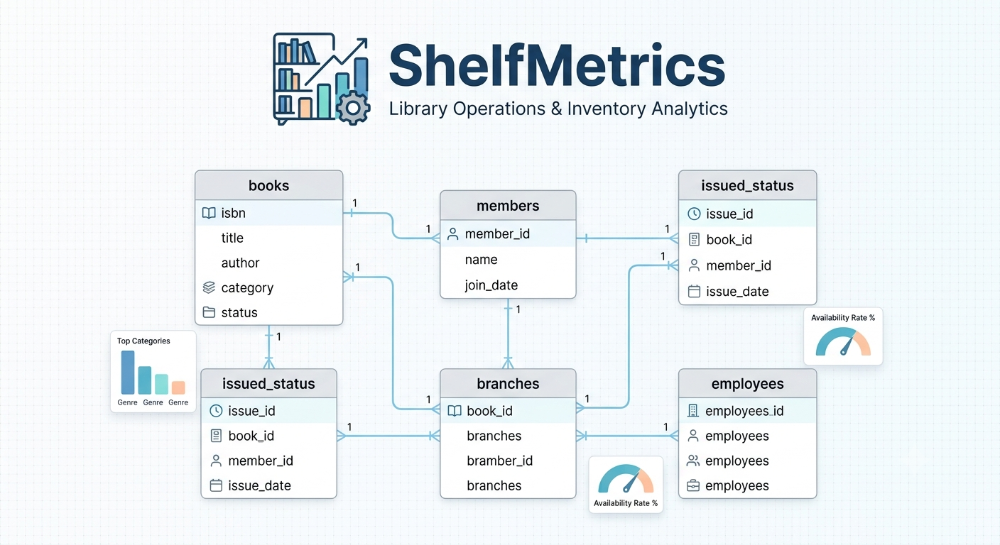
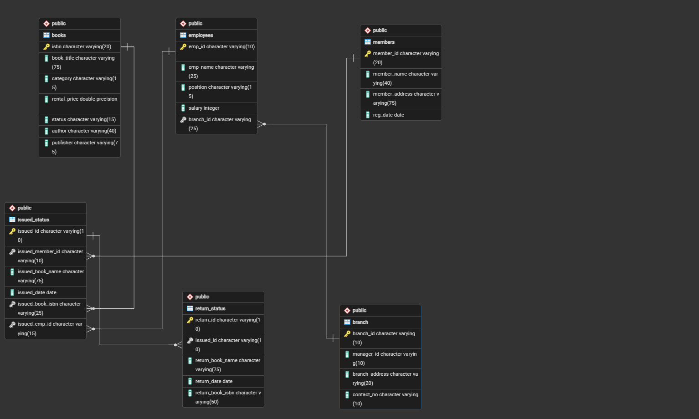

# ShelfMetrics: Library Operations & Inventory Analytics

## Project Overview

ShelfMetrics is a relational database and analytics project designed to manage and optimize library operations. The core objective is to move beyond basic data storage by engineering a robust SQL schema that tracks book inventory, branch productivity, employee structures, member registrations, and transaction lifecycles (loans and returns).

By leveraging advanced SQL queries, ShelfMetrics transforms raw transactional logs into actionable business insights—allowing stakeholders to monitor asset circulation, evaluate branch performance, identify inventory bottlenecks, and optimize overall library efficiency.



# Database Architecture & Schema
The system is built on a relational database design featuring 6 interconnected tables.

* branch: Information about individual library branches (Branch ID, Manager, Address, Contact).

* employees: Employee details, roles, salaries, and branch assignments.

* members: Registered library members and their registration dates.

* books: The library inventory, including titles, ISBNs, categories, rental prices, and availability status.

* issued_status: Tracks books loaned out to members, including issue dates and assigned employee IDs.

* return_status: Records returned books, return dates, and notes on book condition.





# Key Business Problems Addressed
The project is divided into operational queries and advanced data analysis tasks. Key insights generated include:

1. Operational & Inventory Tracking
Book Availability Analysis: Identified specific books currently loaned out versus those available in stock to optimize member fulfillment.

  Branch Performance: Analyzed which library branches generate the highest engagement based on total issued books.

  Active Member Tracking: Isolated members who registered within specific timeframes or who have active, unreturned rentals.

2. Advanced Analytics & Business Insights
Overdue Book & Fine Analysis: Tracked books returned past their expected duration to help the library identify potential revenue leakage or inventory blockages.

  Employee Performance & Workload: Evaluated which employees are handling the most transactions to optimize branch staffing levels.

  Category Popularity: Segmented book rentals by genre/category to assist the procurement team in deciding which books to buy more of in the future.

# SQL Concepts Demonstrated

This project showcases a wide range of data manipulation and analysis techniques, including:

* DDL & DML: Designing table structures, defining primary/foreign keys, and managing data consistency.

* Complex Joins: Utilizing INNER JOIN, LEFT JOIN, and multi-table joins to unify disparate tracking data.

* Aggregation & Filtering: Grouping metrics using GROUP BY, HAVING, and window functions to calculate totals and averages.

* Subqueries & CTEs: Breaking down complex business logic (like identifying overdue books) into clean, readable queries.

# Project Repository Structure

📁 Datasets/: Contains the raw CSV data files used to populate the system (books.csv, members.csv, etc.).

📄 Schemas.sql: The full SQL script defining the tables, constraints, and relational schema.

📄 Task File.sql: The core analysis file containing all the business questions and the SQL solutions developed to solve them.

📄 ERD.pgerd: The database design diagram.

# How to Run This Project
Clone the repository:

```bash
git clone https://github.com/YOUR_USERNAME/Library-Management-System-SQL.git
```

- Setup the Database: Open your preferred SQL workbench (PostgreSQL, MySQL, SQL Server), create a new database, and execute the queries inside Schemas.sql to build the infrastructure.

- Import Data: Load the datasets from the Datasets/ folder into their respective tables.

- Run Analysis: Execute the queries in Task File.sql to explore the business insights.
